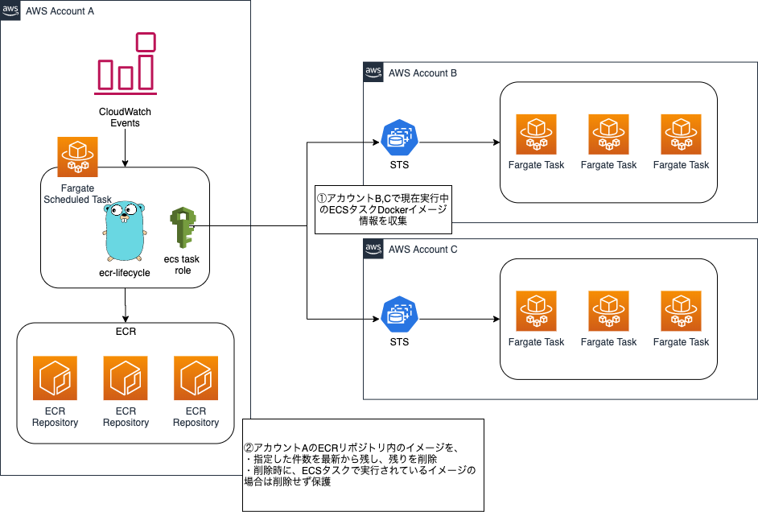

# ecr-lifecycle

- ECRのイメージを,指定した件数より古いバージョンを削除
- ECSタスクとして現在実行されている場合、削除せず保護

# Usage

```shell script
$ ecr-lifecycle delete-images --template config.yml

# or
$ ecr-lifecycle delete-images --ecr-assume-role-arn arn:aws:iam::12345678901:role/hoge \ 
  --ecs-assume-role-arns arn:aws:iam::12345678901:role/fuga \ 
  --ecs-assume-role-arns arn:aws:iam::12345678901:role/piyo \ 
  --region ap-northeast-1 
  --keep 50
```

# Motivation

AWSが提供しているECRのライフサイクルポリシーは指定した件数のみ残し削除や指定した期間が経過したら削除などはできるが、コンテナとして実行中だとしても無視して削除されてしまう。
今回はECSタスクを監視し、イメージが使われているのであれば削除せず保護するようにした。

# 全体図



# development

開発時は `~/.aws/credentials` のprofileを指定できます。

```shell script
$ make build
$ bin/ecr-lifecycle --profile hoge --template config.yml
```
